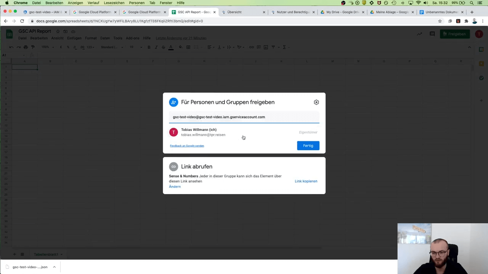
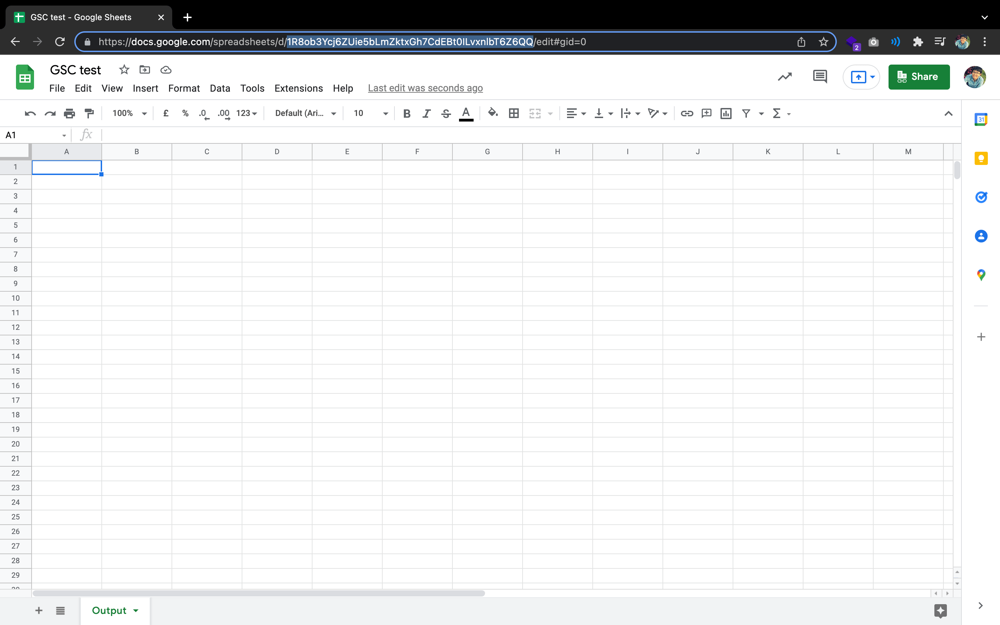
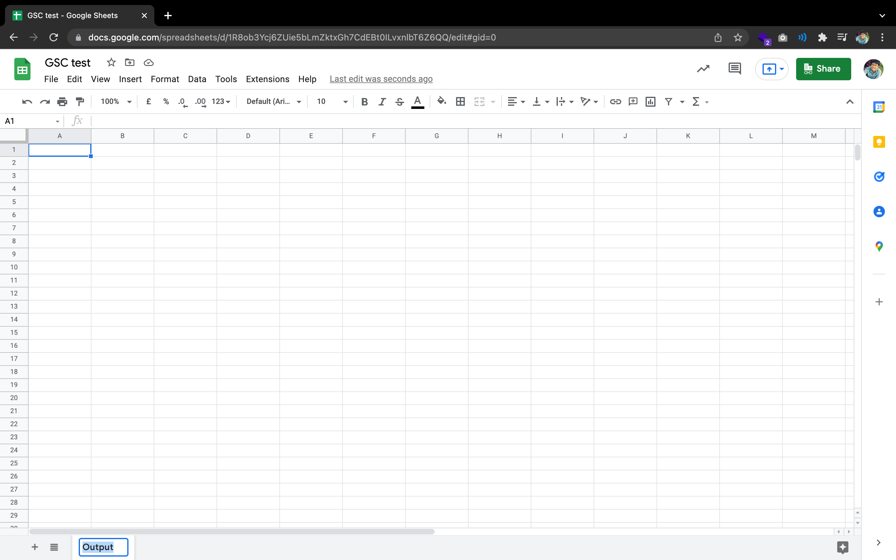

# Google Search Console
1. Copy the SITE_URL from the project name and paste to the environment variables. 

# Google service account
### Create service accounts
* IAM and admin -> Service accounts -> CREATE SERVICE ACCOUNT  
Ref: https://cloud.google.com/docs/authentication/getting-started?hl=en#creating_a_service_account
### Generate service account key JSON file
* IAM and admin -> Service accounts -> click $EMAIL -> KEYS -> ADD KEY -> Create new key  
Ref: https://cloud.google.com/docs/authentication/getting-started?hl=en#creating_a_service_account


# Google Sheets
1. Create the Google Sheets.  
2. Give Google Sheets access of **Editor** to the `client-email` defined in the service account key JSON
  
3. Copy the SHEET_ID from the URL and paste to the environment variables.  
  ```
  https://docs.google.com/spreadsheets/d/{SHEET_ID}/edit#gid=0
  ```
  
4. Copy the target SHEET_NAME and paste to the environment variables.  
  
# Environment variables
### GOOGLE_APPLICATION_CREDENTIALS
1. Open the terminal config file with command line editor
    ```sh
    vim ~/.zshrc
    ```
    or
    ```sh
    vim ~/.bashrc
    ```
2. Add the environment variable to the terminal config file
    ```
    export GOOGLE_APPLICATION_CREDENTIALS="/$PATH_TO_THE_SERVICE_ACCOUNT_JSON_FILE"
    ```
    * Notes: Replace `$PATH_TO_THE_SERVICE_ACCOUNT_JSON_FILE` with the path you store the key JSON file generated by the Google service account.  
    * Ref: https://cloud.google.com/docs/authentication/getting-started?hl=en#creating_a_service_account
### Required environment variables in the *.env* file, which should be located at the root directory of the project
```
SITE_URL=""   
SHEET_ID=""   
SHEET_NAME=""   
```

# Tutorials reference
* [How to use Google Search Console API and Google Cloud Functions with Javascript/nodejs to push search performance data to Google Sheets](https://willmanntobias.medium.com/how-to-use-google-search-console-api-and-google-cloud-functions-with-javascript-nodejs-to-push-39f9a144757f)
* [Use GSC API and Google Cloud Functions with nodejs to push data to Google Sheets ("live coding")](https://www.youtube.com/watch?v=_S-_wrgPGgo)
* [Github repository: Zrce/gsc-api-test-video](https://github.com/Zrce/gsc-api-test-video)